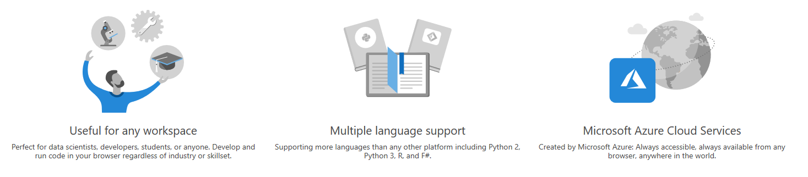
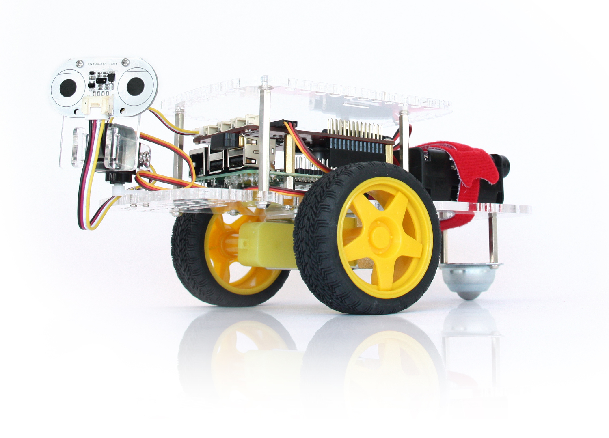
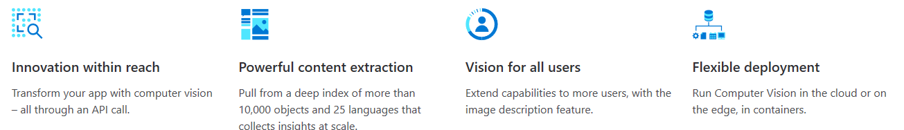
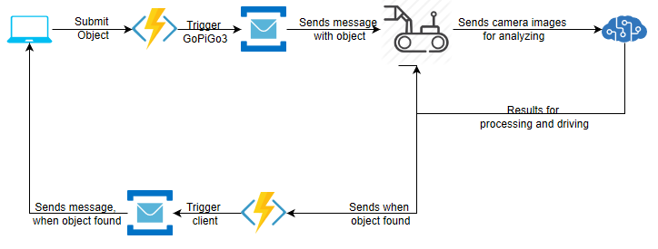

I was caught up by the possibility to share an Azure setup we use in an educational context. So this little story is written in the context of #AppliedCloudStories (http://aka.ms/applied-cloud-stories).

# AZURE NOTEBOOKS AND COGNITIVE SERVICES WITHIN AN UNIVERSITY CLASS

This story will cover up what and how we used Azure provided Services to enrich the learning experience within a lecture. I was motivated to set this up, cause I'm working as an assistant in that course and I'm working closely together with the professor. 

## WHAT IS THIS ABOUT?
This story shows how we used Azure Notebooks (https://notebooks.azure.com/) for providing an interactive learning experience in class. In addition to that, our students had to work on a project, which was about an autonomous vehicle that should navigate to a specific target. For that Computer Vision was introduced to the students and we used Azure Cognitive Service (https://azure.microsoft.com/en-us/services/cognitive-services/) as an applied cloud service for that project.

I'm going to describe, why and how we used Azure Notebooks in our class. Also, you'll see how it's possible to use Azure Cognitive Services within Azure Notebooks which will then transit into the usage within the student projects.  

## AZURE NOTEBOOKS

There was always a big motivation for using Jupyter Notebooks within the class. But there are some requirements, that'd slow down the lecture (You know, it's not a Data Science lecture). Azure Notebooks were providing a great environment to use Jupyter Notebooks without explaining how to set up a Jupyter server. It was also easy to share Notebooks with the students. Azure Notebooks provides a couple of different programming languages. One of them is python, which is amazing (The students in our lecture learn python). 

### THE SETUP
The notebooks are capable to run code segments and change code within the environment. So I was creating the slides for the practical exercises in Azure Notebooks. This was great because everyone was able to use the same python environment. No IDE differences, no package differences, no python differences. The students just had to create a Microsoft account or use the one they have, to access the notebook, clone it and run it on free tier to work with it. It's that straight forward. So the students were able to interactively follow the slides and have running examples for the ongoing course.

## COGNITIVE SERVICES
In our class, the students must work on a project, that includes an autonomous vehicle. Every semester it's a little bit different. But there are some things, that won't change:
* It must work with applied cloud technologies
* The autonomous vehicle is the GoPiGo3 from dexter industries (https://www.dexterindustries.com/)

One of the projects was about letting the GoPiGo3 find a specific object within a room and drive to it. For achieving this goal, we introduced computer vision as XaaS (where X stands for AI), which is applied cloud technology. 

### THE SETUP
Azure Cognitive Services provides a service for doing computer vision on pre-trained models for describing images. We set up the cognitive service for computer vision within the azure free tier with the students. The provided API endpoints for analyzing the images were then accessible over HTTP. Those endpoints are now callable within python.
#### AZURE NOTEBOOKS
The HTTP endpoints are accessible over python packages, that handle HTTP requests and responses. Those packages are included already in Azure Notebooks. Giving the students a simple scenario, we began with predefined images, that are stored on the web. Next step, we provided some images available cloud storage (blob storage from azure), so they could see how this is working. We described the pipeline with azure functions for automatically tagging those images as the last demo for the students. After the students were able to access the computer vision API through HTTP in azure notebooks, the next step for them was including that in their projects.

#### STUDENT PROJECT
The project was about an autonomous vehicle (GoPiGo3), that should find an object within a room and then drive to it. The GoPiGo3 includes a raspberry pi, that can have a camera attached to it. The camera can process the images over OpenCV (https://opencv-python-tutroals.readthedocs.io/en/latest/py_tutorials/py_tutorials.html). The frames can be sent to Azure computer vision API to analyze the frames and find the object. For that, the students react to input, that will provide what the object to find. The GoPiGo3 will start it's trip to find the object. 

## SOLUTION
One possible solution to achieve this goal would be using an azure function that listens to the input and triggers the GoPiGo3 to start. For that, it could use the service bus queues. The GoPiGo3 will start to search the room. While doing that, it'll send frames from the camera to Azure computer vision API, until it finds the object. Then it'll drive to the location.

This is one possible solution to solve it. Of course, there are many more :)

## SOME FINAL WORDS
It was awesome, how good the results were. The students had an easy environment with the Azure notebooks to start. This was giving us general positive feedback. After they were familiar with the used IDE, they could still refer to the samples in their slide set. It was also great to show how easy it is to use cloud technologies, especially add AI to project. They were all mostly astonished what they were able to do within the given time frame. This was a truely success for the whole setup (at least in my opinion, but maybe I'm biased)