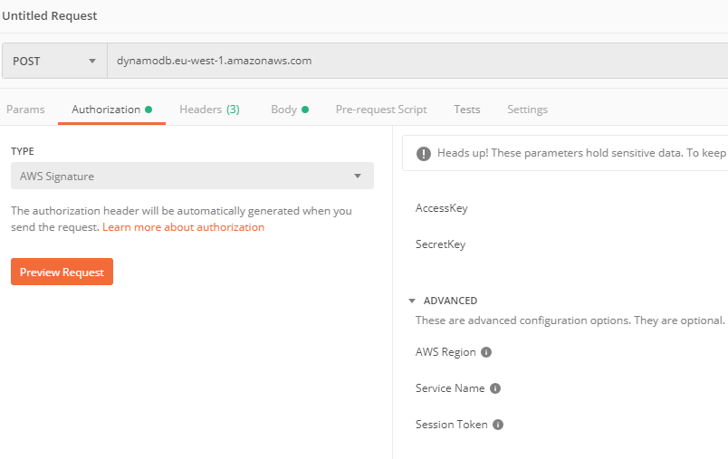

This is Part I of III from [How to create a blazor web app with datastore, authentication/authorization and hosting for nothing](readme.md)
# Amazon DynamoDB 
You have to read it carefully. I studied the scenario round about 45 minutes to get it. So the first 2.5 million read or write requests (more or less) per month are included.
After checking this out, I just started with creating a table over the management console. Over the web interface, you can do that quite easily. After you created the table, you can also add items over the web interface and change the structure of it (add additional columns). I won't go into details here, cause AWS already provides a good tutorial here (https://docs.aws.amazon.com/dynamodb/index.html).

To use DynamoDB within .NETCore, you can have a look into Daniel Donbavands (@Donbavand on twitter) posts  (https://danieldonbavand.com/dynamodbtable/). Awesome step by step intro. You could also use the native HTTP-Request calls (referred to as low-level API in AWS (https://docs.aws.amazon.com/amazondynamodb/latest/developerguide/Programming.LowLevelAPI.html)).


# AWS Lambda Functions
If you want to start with AWS lambda functions, I can recommend this repos (https://github.com/aws-samples/aws-net-guides/tree/master/Serverless/Serverless%20App%20with%20Dynamo-Example). 

I followed the recommendations here and created the function with .NETCore CLI:
* install Template:
```
dotnet new -i Amazon.Lambda.Templates::*
```
* install the tools for .NETCore CLI
```
dotnet tool install -g Amazon.Lambda.Tools
```
* create new project with template:

```
dotnet new serverless.EmptyServerless
```
And we are ready to go. In the created src folder is the project with one .cs file called **Function.cs**. Here is, where the magic happens.

If you follow the instruction given in the mentioned repos, you set up the deployment template of the lambda function. 

I created a bucket over the AWS console and used that bucket to publish my lambda function to AWS. To do the publish, you can call .NETCore CLI function with corresponding parameters for the stack and bucket. 
```
dotnet lambda deploy-serverless --region <REGION> --stack-name <STACK_NAME> --s3-bucket <BUCKET_NAME>
```
You can look the options up with --help
```
dotnet lambda deploy-serverless --help
```
You can test our deplyoment with the .NETCore CLI or with Postman. I'm going to check it out with postman (https://www.getpostman.com/).

Postman is the tool I use to test API calls. It has everything to set up the Http calls to AWS. An authorization-helper for AWS is out of the box available. 

As you can see, you select the authorization type and enter, what is needed. The http request will automatically generate the right settings.

## DynamoDB in lambda function

The lambda function project is a .NETCore project. We can use the sdk provided by AWS. We need this nuget package:
```
AWSSDK.DynamoDBv2
```
After we add this nuget package to our lambda function project, we can create the handler for DynamoDB. You'll find a complete overview about the availabe methods in the documation (https://docs.aws.amazon.com/amazondynamodb/latest/developerguide/DotNetSDKHighLevel.html). I'm just going into provide the code, I needed for my scenario. And it's more like a small little summary of code. (But feel free to ask for more. Questions and feedback is always welcome).

### Scan for Item
I created a small method, for setting up a DynamoDB client.
```csharp

using Amazon.DynamoDBv2;
using Amazon.DynamoDBv2.DataModel;
using Amazon.DynamoDBv2.DocumentModel;

namespace...{ 

    public class DynamoDBHelper{
        . // Whatever you code is
        .
        .
        //Returns a DynamoDBClient
         static AmazonDynamoDBClient  SetupDynamoDbClient()=>
            new AmazonDynamoDBClient(
                "",//AWS access key
                "", //AWS secret key
                new AmazonDynamoDBConfig(){
                    RegionEndpoint = //region
                });
    }
}

```

This method is used to get a DynamoDBClient object, which is used to establish a connection to dynamodb and execute the action. Below you find the code, for retrieve data with a restricton. This is done with *scanning* in AWS.

```csharp

using Amazon.DynamoDBv2;
using Amazon.DynamoDBv2.DataModel;
using Amazon.DynamoDBv2.DocumentModel;

namespace...{ 

    public class DynamoDBHelper{
        . // Whatever you code is
        .
        .
        //IData is an interface of the data, we read from dynamoDB, filtered by the scanFor parameter
        internal static async Task<List<IData>> Get (string scanFor){
           try{
                using(var context = new DynamoDBContext (SetupDynamoDbClient())){ // create new DynamoDBContext with DynamoDBClient
                    var data = await context.ScanAsync<IData>( // Scan for IData
                        new List<ScanCondition>(){ //Add scanconditions
                            new ScanCondition("ID",ScanOperator.BeginsWith, scanFor ) // column, operator, scanFor
                            }).GetRemainingAsync();
                    return data.ToList();
                }
                
           }
           catch(Exception ex){
               Console.WriteLine(ex.Message);
               return new List<IData>();
           }
        } 
    }
}

```

## Usage in blazor (wasm)

I'm a big fan of the current blazor framework from Microsoft (https://docs.microsoft.com/en-us/aspnet/core/blazor/?view=aspnetcore-3.1). I could talk a lot about the current approach, and why I'm so impressed by that technology. But it's not the right place to do so now. The major things, that I want to focus here, are the usage of .NETCore/.NETStandard2.1 to code a web application. This is possible, because mono is ported into a webassembly (WASM). And that is awesome for C# developers. On top, you have the possibility to use your javascript framework of choice and work with both ends of stack symbiotic. 


### AWS lambda function modifacations
But none the less, there are some offsets you have to live with. E.g. it's not a hosted application, so you need a server. To consume http services, they need to enable CORS (https://developer.mozilla.org/en-US/docs/Web/HTTP/CORS). In my scenario, my lambda function has to enable exactly that.
Luckily, that's just an easy thing to do. In the reponse header dictionary, you just add exactly the needed CORS settings.

```csharp
//Right from the Function.cs file
 public async Task<APIGatewayProxyResponse> Get(APIGatewayProxyRequest request, ILambdaContext context)
        {
            context.Logger.LogLine("Get Request\n");
            var response = new APIGatewayProxyResponse
            {
                StatusCode = (int)HttpStatusCode.OK,
                Body =  JsonConvert.SerializeObject(await Data.ComicData.GetComics()),
                Headers = new Dictionary<string, string> { 
                    { "Content-Type", "application/json" } ,
                    { "Access-Control-Allow-Origin", "*" } //Add CORS for all origins
                }
            };

            return response;
        }
```
In our blazor wasm application, we can now get the data, by calling the AWS lambda API gateway. You can look the API gateway up in your AWS console.

Below you find a short code snippet, to get the data from the AWS lambda function:
```csharp
using System;
using System.Net.Http;
using System.Collections.Generic;
using System.Linq;
using System.Threading.Tasks;
using Newtonsoft.Json;
using Newtonsoft.Json.Linq;

namespace...{ 
//within your blazor project:
    class Reader{
    .
    .
    . 
        internal async Task<IEnumerable<IData>> Get (){
                try{
                        using(var httpClient = new HttpClient()){
                            var response = await  httpClient.GetAsync("");//Endpoint of AWS API gateway
                            if(response.IsSuccessStatusCode){
                                var json = await response.Content.ReadAsStringAsync(); //read json body
                                
                                var data = (IEnumerable<IData>)JsonConvert.DeserializeObject(json, typeof(IEnumerable<IData>)); // deserialize json to IEnumerable<IData>
                                return data;
                            }
                            else{
                                throw new Exception(await response.Content.ReadAsStringAsync()); //throw error content as exception
                            }
                        
                        }
                }
                catch(Exception ex){
                    Console.WriteLine(ex.Message);
                    return new List<IData>();
                }
                
            }
        }
}
    
```
# Summary Blazor WASM set up (AWS PARTS)
With that said, you know enough to
* create a AWS dynamodb table and store data
* create a AWS lambda function (now we are serverless)
* Work with dynamodb and lambda functions and provide the API gateway to access the lambda function
* modify the blazor webassembly project to retrieve your data

We are totally serverless, mates.