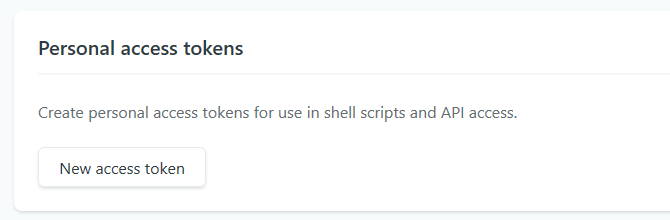
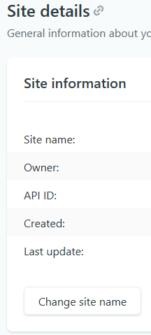

This is Part I of III from [How to create a blazor web app with datastore, authentication/authorization and hosting for nothing](readme.md)
# Netlify

I got really intreseted about netlify, because it offers an easy, with github and azure devops services (if you're intrested in it, I can write my thoughts about it down here as well. Just keep that in mind ;)) integratable plattform for deploying and hosting your website. 

And, even more important, it offers a free tier to do so. You could upload your app also just via uploading the finished project. It's on you, how you do it. 

As I put my application in this scenario on GitHub, I setup the github integration and used GitHub actions for doing some continous deployment, because why not :)

## Steps to publish and continous deplyoment
We're going to set this up right now:
### 1. publish your blazor wasm and push it to github.
```
dotnet publish -c release
```
### 2. Create a new site on netlify
Go to netlify on your teams site and create a new site. You can do this, by uploading your published folder, containing your index.html.
### 3. Setup GitHub actions
GitHub Actions are great to automate your software development workflow. These Actions can be combined to a workflow, to help your with your build, test, package, release or deploy within your GitHub repos (https://help.github.com/en/actions/automating-your-workflow-with-github-actions/about-github-actions
). 

We take advantage of that possiblity to create a continous deployment pipeline from my GitHub repo to netlify.

1. Get a personal access token from the netlify settings page (https://app.netlify.com/user/applications) This token is needed in the GitHub Action.

**NEVER NEVER NEVER NEVER EVER SHARE THIS TOKEN!**

**I'M SERIOUS**

**DON'T SHARE**

2. Get your sites APP ID. You'll find it on your site's settings. This APP ID is also needed in the GitHub Action


3. Go to your GitHub repo. Navigate to settings. In the settings tab, select Secrets. Add Secrets for your netlify access token (e.g. NETLIFY_AUTH_TOKEN) and your netlify APP ID (e.g. NETLIFY_APP_ID). These will be used in the GitHub Action.


4. Create a .NETCore workflow in the Actions tab. There is already a workflow for .NET Core availabe. The creation of the .NET Core workflow will create a dotnetcore.yml file in the repo. Here we have to specify, what we need to build our blazor app. We set this up to run on a push action. You can use the code below and modify it to your needs. 
```
name: BlazorOnNetlify #your workflow name
on: [push] #on push to your branch run this workflow

jobs:
  build:
    runs-on: ubuntu-latest
    steps:
    - uses: actions/checkout@v1
    - name: Setup .NET Core
      uses: actions/setup-dotnet@v1
      with:
        dotnet-version: 3.1.101 #Blazor WebAssembly requires 3.1.100 or higher
    - name: Build with dotnet
      run: dotnet build --configuration Release
    - name: Publish Blazor webassembly using dotnet 
#create Blazor WebAssembly dist output folder in the project directory
      run: dotnet publish -c Release --no-build -o ./
    - name: Publish generated Blazor webassembly to Netlify
      uses: netlify/actions/cli@master #uses Netlify Cli actions
      env: # these environment variables are added in github secrets
          NETLIFY_AUTH_TOKEN: ${{ secrets.NETLIFY_AUTH_TOKEN }}
          NETLIFY_APP_ID: ${{ secrets.NETLIFY_APP_ID }}
      with:
          args: deploy --dir=BlazorOnNetlify/dist --prod #push dist folder to Netlify
          secrets: '["NETLIFY_AUTH_TOKEN", "NETLIFY_APP_ID"]' 
```

After this is all setup and push the changed sourcecode back to GitHub, the workflow should start. After it's done, the website should be available on netlify.

# Some additonal comment
You can use GitHub Actions to automate your the publish of the aws lambda function.

You can handle the deployment tasks in netlify as well, but for me it was more natural to put this in my repos. Same is for AWS Lambda. 

# Finale words
As you can see, we have created a serverless web application and published it to netlify as a host without spending a single dime. Isn't that crazy and great, what you can do for free? I, for myself, am totally hyped about this all. And I can't wait, what we can achieve in this environment. 